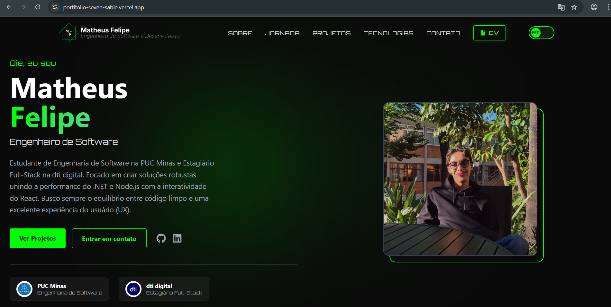
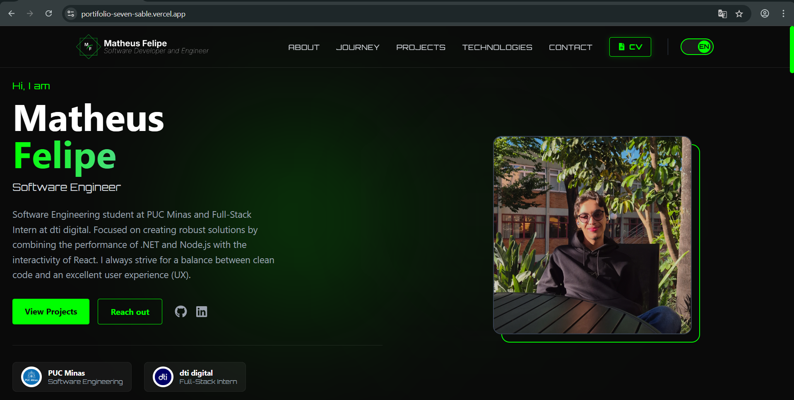

# 🚀 Portfólio Profissional

Este repositório contém o código-fonte do meu portfólio profissional, desenvolvido como projeto central para a disciplina de **Laboratório de Desenvolvimento de Software** na **PUC Minas**. O sistema foi projetado para apresentar minha trajetória, projetos e habilidades de forma moderna e bilíngue.

O foco do projeto é a **identidade visual coerente** e a **experiência do usuário**, utilizando uma interface Dark/Neon com animações fluidas e suporte completo a internacionalização.

## 🎯 Funcionalidades e Diferenciais

* **🌎 Internacionalização (i18n):** Suporte completo a Português e Inglês com troca dinâmica de conteúdo (Sobre Mim, Experiências e Projetos).
 * **📅 Timeline de Projetos:** Exibição cronológica de projetos com detalhes técnicos e integração com GitHub.
 * **💼 Experiências Profissionais:** Seção dedicada ao histórico profissional e acadêmico com visual moderno.
 * **📨 Formulário de Contato:** Integração com EmailJS para envio de mensagens diretamente pelo site, além de links diretos para WhatsApp e LinkedIn.
 * **🎨 Interface Neon & Dark:** Design moderno com animações suaves utilizando Framer Motion e estilização Tailwind CSS.

## 🚀 Tecnologias Utilizadas

| Camada | Tecnologia | Detalhes |
 | --- | --- | --- |
 | **Framework** | React (Vite) | Desenvolvimento ágil de componentes e build otimizado. |
 | **Estilização** | Tailwind CSS | Design utilitário com sistema de cores neon personalizado. |
 | **Animações** | Framer Motion | Transições suaves e efeitos de scroll na jornada. |
 | **Comunicação** | EmailJS | Integração direta com serviço de e-mail sem necessidade de back-end próprio. |
 | **Context API** | React Context | Gerenciamento global do estado de idioma entre componentes. |

## 📝 Documentação e Links Úteis

A organização do projeto segue as diretrizes da Sprint 03 do Laboratório:

* **[Manual de Instalação e Configuração de variaveis de ambiente ](https://github.com/MatheusFelipeCorrea/Portifolio/blob/main/Documents/Manual.md):** Como rodar o ambiente localmente e Configurações necessárias para o envio de e-mails..
 * **[Demonstração Online](https://portfolio-one-swart-52.vercel.app/):** Link oficial da aplicação hospedada na nuvem (Matheus Felipe).
 * **[Demonstração Online](https://www.google.com/search?q=https://seu-portfolio.vercel.app):** Link oficial da aplicação hospedada na nuvem (Alice Shikida).
 * **[Wireframes Iniciais](https://github.com/MatheusFelipeCorrea/Portifolio/blob/main/Documents/Wireframes/Wireframe%20Inicia… Link para o primeiro protótipo do Portfolio do aluno Matheus Felipe Correa.

---

## 📂 Estrutura de Pastas

```
 .
 ├── public/ # 🌐 Recursos acessíveis via URL direta (não processados pelo build)
 │ ├── pdfs/ # 📄 Arquivos de currículo (PT/EN) e certificados de pesquisa [cite: 51]
 │ ├── projects/ # 🖼️ Imagens e GIFs de demonstração dos projetos [cite: 19]
 │ └── logos/ # 🏢 Logotipos institucionais (PUC Minas, dti digital) [cite: 22]
 ├── src/ # 🚀 Código-fonte da aplicação
 │ ├── assets/ # 🖼️ Recursos de mídia processados pelo Vite (fotos e ícones locais)
 │ ├── components/ # 🧱 Componentes React reutilizáveis (Navbar, Hero, Modais, etc.) [cite: 46, 68]
 │ ├── context/ # 🌎 Gerenciamento de estado global (Context API para i18n/Idioma) [cite: 51]
 │ ├── data/ # 📜 Base de dados em JS (textos dinâmicos, listas de projetos e experiências) [cite: 52, 53]
 │ ├── hooks/ # 🎣 Hooks personalizados para lógica de tradução e estados (useLanguage)
 │ └── App.jsx # 📄 Componente raiz que orquestra a estrutura das seções
 ├── tailwind.config.js # 🎨 Definições do Design System (cores neon, fontes Orbitron/Sans) [cite: 29]
 └── .env.example # 🧩 Modelo das variáveis de ambiente necessárias para o EmailJS [cite: 54, 93]
 ```
 ### Destaques da Arquitetura:

* **Separação de Dados:** Toda a parte textual está isolada em `/data`, facilitando a internacionalização sem precisar mexer na estrutura dos componentes.
 * **Gerenciamento de Mídia:** Imagens pesadas de projetos e documentos oficiais (PDFs) ficam em `/public` para garantir que o carregamento via modal seja rápido e eficiente.
 * **Estilização:** O arquivo `tailwind.config.js` centraliza a identidade visual, garantindo a coerência exigida nos requisitos do projeto.

---
 ## 👥 Autores

| 👤 Nome | :octocat: GitHub | 💼 LinkedIn |
 |--------------------|----------------------------------------------------------------------------------|--------------------------------------------------------------------------------|
 | **Matheus Felipe** | [GitHub](https://github.com/MatheusFelipeCorrea) | [LinkedIn](https://www.linkedin.com/in/matheus-felipe-correa-29b262265/) |
 | **Alice Shikida** | [GitHub](https://github.com/aliceshikida) | [LinkedIn](https://www.linkedin.com/in/alice-shikida/) |
 ---

## 🎥 Demonstração

## 👤 Matheus Felipe
 | Home PT | Home EN |
 | --- | --- |
 |  |  |

## 👤 Alice Shikida
 | Home PT | Home EN |
 | --- | --- |
 |  |  |

## 📄 Licença

Este projeto é distribuído sob a **Licença MIT**.

---
